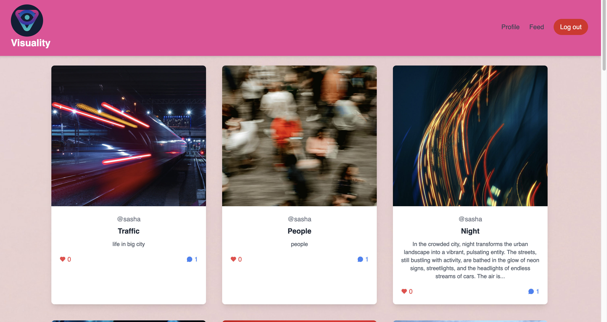

# Social Media App
[Visuality Social Media](https://social-media-visuality-6b16f66b0b08.herokuapp.com/)

 
 
 
 
[trello workspace](https://trello.com/b/6MKoaEuz/backlog)

A full-stack social media application built with Node.js, Express.js, MongoDB, and Tailwind CSS. Users can create profiles, upload posts, organize posts into boards, and interact with other users' content. The app also integrates a **Weather API** and an **AI Image Generator** powered by DeepAI.

---

## Features

### 1. **User Authentication**
   - Signup, Login, and Logout functionality.
   - Password hashing and session management using Passport.js.

### 2. **Profile Management**
   - Upload and update profile images.
   - Edit user details (username, email, full name, contact).

### 3. **Post Management**
   - Create, read, update, and delete posts.
   - Upload images for posts.
   - Organize posts into boards.

### 4. **Feed**
   - View posts from all users.
   - Like and comment on posts.

### 5. **Weather API Integration**
   - Display real-time weather information on the profile page.

### 6. **AI Image Generator**
   - Generate images for announced themes using DeepAI.
   - Affordable and fast image generation.

### 7. **Interactive UI**
   - Background carousel for a dynamic user experience.
   - Responsive design using Tailwind CSS.

---

## Tech Stack

- **Frontend**: EJS (for server-side rendering), Tailwind CSS (for styling).
- **Backend**: Node.js, Express.js.
- **Database**: MongoDB (with Mongoose for schema modeling).
- **Authentication**: Passport.js (Local Strategy).
- **File Upload**: Multer (for handling image uploads).
- **Session Management**: Express Session.
- **APIs**: 
  - **Weather API**: Integrated into the navigation bar.
  - **DeepAI API**: For AI-generated images.

---

## Entity-Relationship Diagram (ERD)

### Entities
1. **User**
   - `id` (Primary Key)
   - `username` (Unique)
   - `email` (Unique)
   - `password` (Hashed)
   - `fullname`
   - `profileImage` (URL or file path)
   - `contact` (Optional)
   - `boards` (Array of board IDs)
   - `posts` (Array of post IDs)

2. **Post**
   - `id` (Primary Key)
   - `title`
   - `description`
   - `image` (URL or file path)

3. **Board**
   - `id` (Primary Key)
   - `name`
   - `user` (Foreign Key to User)
   - `posts` (Array of post IDs)

### Relationships
- **User** → **Post**: One-to-Many (A user can create many posts).
- **User** → **Board**: One-to-Many (A user can create many boards).
- **Board** → **Post**: Many-to-Many (A board can have many posts, and a post can belong to many boards).

---

## API Endpoints

### User APIs
- **Signup**: `POST /auth/signup`
- **Login**: `POST /auth/login`
- **Logout**: `GET /auth/logout`
- **Get User Profile**: `GET /users/:userId`
- **Update User Profile**: `PUT /users/:userId`
- **Delete User Account**: `DELETE /users/:userId`
- **Get User's Posts**: `GET /users/:userId/posts`
- **Get User's Boards**: `GET /users/:userId/boards`

### Post APIs
- **Create Post**: `POST /posts`
- **Get All Posts**: `GET /posts`
- **Get Post by ID**: `GET /posts/:postId`
- **Update Post**: `PUT /posts/:postId`
- **Delete Post**: `DELETE /posts/:postId`
- **Add Post to Board**: `POST /boards/:boardId/posts`
- **Remove Post from Board**: `DELETE /boards/:boardId/posts/:postId`

---

## Deployment

The app is deployed on **Heroku**. You can access it here: [Live Demo](https://social-media-visuality-6b16f66b0b08.herokuapp.com/) <!-- Add your Heroku link here -->

---

## Setup Instructions

###  Clone the Repository
```bash
git clone https://github.com/Liliyalexx/Social-Media.git
cd Social-Media

### **Future Enhancements**
In future updates, I plan to enhance the **AI Image Generator** feature by replacing the current **button-based image selection** with a more **detailed description-based AI generation**. This will allow users to input a more **specific text prompt**, resulting in **more customized and accurate** AI-generated images. This improvement will enhance user experience by providing more **personalized and meaningful** visual content.